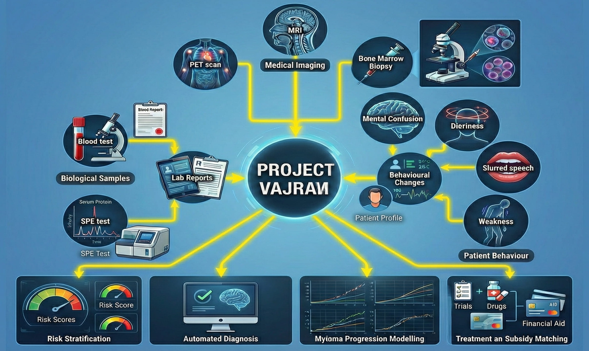

<div align="center">

# 🧬 Project VAJRAM

### Virtual Agent for Joint Risk Assessment of Multiple Myeloma

[](https://python.org)
[](https://huggingface.co/google/medgemma-1.5-4b-it)
[](https://langchain-ai.github.io/langgraph/)
[](LICENSE)
[](https://wandb.ai/da24s004-iitm/huggingface/reports/Project-VAJRAM-Experiments---VmlldzoxNjAyMzcyMg?accessToken=785okknc7nwdxh8o81aj06xbtjwtgg2bfuvzpbqkem2gh4n4a02bh1yi75kl88zn)

<br/>

*An agentic, multi-LoRA AI system for end-to-end clinical decision support in Multiple Myeloma diagnosis, progression tracking, and treatment planning — running entirely on local hardware.*

<br/>



</div>

---

## 📌 Overview

**Multiple Myeloma (MM)** is the 2nd most common hematological malignancy. Despite being highly treatable, patient outcomes are routinely compromised by fragmented records, delayed specialist access, and reactive intervention strategies.

**VAJRAM** addresses these gaps through a **5-module AI architecture** that ingests raw clinical data and produces a structured, evidence-backed treatment recommendation — entirely on-premises with no external API calls.

The system uses Google's **MedGemma 1.5 (4B)** as its foundation model and dynamically hot-swaps lightweight **LoRA adapters** per diagnostic task, making deployment feasible in Tier-2/Tier-3 hospitals and other resource-constrained clinical environments.

---

## 🏗️ Architecture: The 5-Pillar System

```
                        Raw Clinical Input
                               │
                               ▼
                  ┌────────────────────────┐
                  │     Module 2           │  LoRA: lora_module2
                  │   Risk Stratification  │  → Myeloma Risk Score (CRAB + R-ISS)
                  └────────────┬───────────┘
                               │
                               ▼
                  ┌────────────────────────┐
                  │     Module 3           │  LoRA: lora_module3
                  │   Diagnostic Vision    │  → Bone Marrow WSI Plasma Cell Detection
                  └────────────┬───────────┘
                               │
                               ▼
                  ┌────────────────────────┐
                  │     Module 4           │  LoRA: lora_module4
                  │   Progression Model    │  → Disease Progression Trajectory (IMWG)
                  └────────────┬───────────┘
                               │
                               ▼
                  ┌────────────────────────┐
                  │     Module 5           │  FAISS RAG
                  │   RAG Recommender      │  → Evidence-Based Guideline Retrieval
                  └────────────┬───────────┘  (NCCN / ESMO)
                               │
                               ▼
                  ┌────────────────────────┐
                  │  Master Orchestrator   │  Base MedGemma 1.5
                  │                        │  → Final Treatment Recommendation
                  └────────────────────────┘
```

The agentic graph is implemented using **LangGraph** — each module is a node and state flows sequentially through the pipeline.

<br/>

### 🔷 Module 1 — Intelligent Digitization *(Planned)*

Processes scanned paper lab reports, handwritten prescriptions, and X-ray images via MedGemma's multimodal OCR pipeline. Outputs structured FHIR-compatible patient timelines.

---

### 🔷 Module 2 — Risk Stratification & Early Detection

Fine-tuned on **MIMIC-IV** EHR data. Evaluates CRAB criteria flags:

| Flag | Threshold |
|------|-----------|
| Anemia | Hb < 10.0 g/dL |
| Renal Impairment | Creatinine > 2.0 mg/dL |
| Hypercalcemia | Calcium > 11.0 mg/dL |

NLP-extracted behavioral symptoms are fused with the structured CRAB flags. Trained with **4 augmentation scenarios** (`baseline`, `silent_patient`, `primary_care`, `messy_ehr`) for real-world robustness.

---

### 🔷 Module 3 — Automated Diagnostic Confirmation

Fine-tuned on **SegPC-2021** bone marrow microscopy data. Analyzes 512×512 WSI patches, merges instance segmentation masks, and outputs a binary plasma cell infiltration classification with a confidence narrative.

---

### 🔷 Module 4 — Disease Progression Modeling

Fine-tuned on **MMRF CoMMpass** longitudinal patient trajectories. Applies **IMWG Progressive Disease** criteria — detecting ≥25% relative M-Protein increase with ≥0.5 g/dL absolute rise from nadir — to predict Smoldering → Active MM transitions.

---

### 🔷 Module 5 — Guideline-Based Therapy Recommender

Uses a **FAISS vector store** embedded with NCCN and ESMO Multiple Myeloma guidelines. The base model generates a semantic search query, retrieves the top-2 most relevant guideline chunks, and synthesizes an evidence-grounded treatment pathway.

> 📄 For a detailed explanation of the methodology, see the [full technical proposal](docs/proposal.md).

---

## ⚡ Mixture of Adapters (MoA): Dynamic LoRA Switching

<div align="center">


</div>

To overcome the massive VRAM overhead of loading multiple independent expert models, VAJRAM uses a **Mixture of Adapters (MoA)** approach. Instead of traditional API-based tool calling, the LangGraph state machine dynamically **hot-swaps task-specific LoRA adapters** directly onto a single centralized base model.

When the clinical pipeline reaches a specific node — such as Risk Assessment, WSI Pathology Analysis, or Progression Tracking — the system instantly loads the corresponding adapter, forces the model to reason using that highly specialized clinical "brain," and then seamlessly reverts to the base orchestrator for final synthesis.

**Key benefits of this design:**

- 🖥️ **Low memory footprint** — The entire diagnostic pipeline runs within ~10 GB VRAM, enabled by `peft`-powered sub-second weight swaps. Deployable on standard consumer GPUs.
- 🛡️ **No cross-domain hallucination** — Physically isolated neural pathways per task ensure the orchestrator receives strictly compartmentalized, high-fidelity data before cross-referencing NCCN guidelines via RAG.
- 🏥 **Edge-ready** — No external inference endpoints. The full pipeline runs locally, making it viable in hospitals with strict data governance requirements.

---

## 🛠️ Technical Stack

| Component | Technology |
|-----------|------------|
| Foundation Model | `google/medgemma-1.5-4b-it` |
| Fine-Tuning | QLoRA (PEFT) via `SFTTrainer` · NF4 4-bit quantization · bfloat16 |
| LoRA Config | rank=16, alpha=32, dropout=0.05 · all attention + MLP projections |
| Agentic Orchestration | LangGraph `StateGraph` |
| RAG | FAISS + `sentence-transformers/all-MiniLM-L6-v2` embeddings |
| UI | Gradio Blocks |
| Symptom Extraction | Qwen2.5 3B Instruct via Text Generation Inference (TGI) |
| Training Framework | HuggingFace `transformers`, `peft`, `trl`, `bitsandbytes` |

---

## 📊 Datasets

| Dataset | Module | Usage |
|---------|--------|-------|
| **MIMIC-IV** (PhysioNet) | 2 | EHR risk stratification — filtered via ICD `C90.0` / `203.0` |
| **MIMIC-IV-Note** (PhysioNet) | 2 | Clinical notes for behavioral symptom extraction |
| **SegPC-2021** (Kaggle) | 3 | Plasma cell microscopy for vision LoRA training |
| **TCIA Myeloma Collection** | 3 | External holdout set (85 histopathology samples) |
| **MMRF CoMMpass IA15** | 4 | Longitudinal biomarker trajectories for progression modeling |
| **NCCN / ESMO Guidelines** | 5 | Medical PDF corpus embedded into FAISS vector store |

> ⚠️ Access to MIMIC-IV and MMRF CoMMpass requires credentialed accounts on [PhysioNet](https://physionet.org) and the [MMRF Research Gateway](https://research.themmrf.org) respectively.

---

## 🤗 Pre-Trained LoRA Adapters

Trained adapter checkpoints are publicly available on the Hugging Face Hub:

| Module | Task | Hub Link |
|--------|------|----------|
| Module 2 | Risk Stratification | [](https://huggingface.co/shrishSVaidya/medgemma-1.5-mm-risk-module2) |
| Module 3 | Vision / WSI | [](https://huggingface.co/shrishSVaidya/medgemma-1.5-mm-wsi-module3) |
| Module 4 | Progression Modeling | [](https://huggingface.co/shrishSVaidya/medgemma-1.5-mm-progression-module4) |

Local checkpoints live under `agent_codes/models/`:

| Adapter | Best Checkpoint | Notes |
|---------|-----------------|-------|
| `lora_module2` | `checkpoint-1506` | Risk stratification on MIMIC-IV |
| `lora_module3` | `checkpoint-212` | Vision WSI binary classification |
| `lora_module4` | `checkpoint-201` | Longitudinal progression modeling |

---

## 🚀 Quickstart

### 1. Install Dependencies

```bash
pip install torch transformers peft trl bitsandbytes accelerate
pip install langgraph langchain langchain-huggingface langchain-community faiss-gpu
pip install gradio sentence-transformers datasets
```

### 2. Run the Agent (CLI)

```bash
cd agent_codes
python agent_run.py
```

> Set `TESTING_MODE = False` in `agent_run.py` and ensure trained LoRA checkpoints are present in `models/` to enable adapter hot-swapping.

### 3. Launch the Gradio UI

```bash
cd agent_codes
python app.py
```

Navigate to `http://localhost:7860`. Paste a patient clinical profile and click **Analyze Patient** to get the full 5-module diagnostic output.

---

## 🧪 Training

Fine-tuning notebooks are located in `finetuning_codes/`. Each notebook covers:

- Data loading from the preprocessed JSONL / DatasetDict
- QLoRA adapter setup targeting all linear projection layers
- `SFTTrainer` training loop with gradient accumulation
- Checkpoint saving compatible with `PeftModel.from_pretrained()`

Preprocessed training data is generated by the scripts in `data_preprocessing_codes/`, in the following order:

```
1. mimic_filtering.py             →  cohort + labs
2. mimic_notes_filtering.py       →  discharge notes
3. qwen_pred_behaviour.py         →  symptom extraction
4. prepare_medgemma_risk_data.py  →  final JSONL with 4-way augmentation (Module 2)
5. processing_MMRF.py             →  MMRF CoMMpass DatasetDict + JSONL splits (Module 4)
```

---

## 📈 Experimental Results

All training curves, evaluation metrics, and qualitative examples per module are documented in the W&B report:

[](https://wandb.ai/da24s004-iitm/huggingface/reports/Project-VAJRAM-Experiments---VmlldzoxNjAyMzcyMg?accessToken=785okknc7nwdxh8o81aj06xbtjwtgg2bfuvzpbqkem2gh4n4a02bh1yi75kl88zn)

---

## 📁 Repository Structure

```
VAJRAM/
│
├── agent_codes/
│   ├── agent_run.py              # LangGraph agent: LoRA hot-swapping + RAG + orchestrator
│   ├── app.py                    # Gradio UI for the full agent pipeline
│   ├── push_to_hub.py            # HuggingFace Hub upload script
│   └── models/
│       ├── lora_module2/         # Trained LoRA adapter: Risk Stratification
│       ├── lora_module3/         # Trained LoRA adapter: Vision (WSI)
│       └── lora_module4/         # Trained LoRA adapter: Progression Modeling
│
├── data_preprocessing_codes/
│   ├── mimic_filtering.py            # MIMIC-IV cohort filtering (ICD C90.0/203.0)
│   ├── mimic_notes_filtering.py      # Unstructured clinical notes extraction
│   ├── prepare_medgemma_risk_data.py # Module 2 training data builder (4-way augmentation)
│   ├── processing_MMRF.py            # MMRF CoMMpass longitudinal serializer
│   ├── qwen_pred_behaviour.py        # Qwen2.5 3B symptom extraction via TGI
│   └── sample.py
│
├── finetuning_codes/
│   ├── module2_finetuning.ipynb      # QLoRA fine-tuning: Risk Stratification
│   ├── module3-finetuning.ipynb      # QLoRA fine-tuning: Vision / WSI
│   ├── module4-finetune.ipynb        # QLoRA fine-tuning: Progression Modeling
│   └── module5-rag.ipynb             # RAG pipeline construction
│
├── data/
│   ├── medgemma_risk_training_augmented.jsonl  # Module 2 training corpus
│   ├── mm_longitudinal_labs.csv                # MIMIC-IV myeloma lab pivots
│   ├── mm_patient_cohort.csv                   # MIMIC-IV myeloma cohort
│   ├── qwen_extracted_symptoms.csv             # NLP symptom extraction output
│   ├── module4_data/                           # MMRF CoMMpass DatasetDict
│   └── module4_data_jsonl/                     # MMRF train/eval/test splits (JSONL)
│
└── docs/
    └── proposal.md                   # Full technical proposal and methodology
```


---

## 🤝 Collaborations & Contributions

VAJRAM is an open research initiative, and I'm actively looking for collaborators who want to push this further.

If you are a **clinician, oncologist, or hematologist** — your domain expertise is invaluable. Whether it's validating the clinical reasoning of the model's outputs, contributing annotated case data, reviewing the CRAB/R-ISS scoring logic, or helping define what a truly useful AI decision support tool looks like at the bedside — your perspective is something no dataset can replace.

If you are an **AI/ML engineer or researcher** — there is meaningful technical work ahead: extending Module 1's multimodal digitization pipeline, improving the LoRA adapter training regime, building robust evaluation benchmarks for medical AI agents, as well as making it compute-efficient solution for the patient as well as the doctors.

**Areas where collaboration would be most impactful:**

| Area | Who I'm Looking For |
|------|---------------------|
| Clinical validation & case review | Hematologists / Oncologists |
| Annotated bone marrow WSI/whole body scans/MRI scans for Multiple Myeloma | Pathologists / Lab physicians |
| Real-world EHR integration & FHIR pipelines | Clinical informaticists |
| Model robustness & evaluation design | ML researchers |
| Cost-efficient Edge deployable solution | AI/ML engineers |
| Multilingual support for regional deployment | NLP researchers |

If any part of this project resonates with you — whether you want to validate outputs on real patient data, extend a module, co-author a paper, or simply explore the idea further — I'd genuinely love to hear from you.

<div align="center">

📬 Reach out at **shrishsvaidya@gmail.com** or connect via [LinkedIn](https://www.linkedin.com/in/shrishsvaidya/)

*Code cannot cure cancer, but it can arm the doctors who do. Let's build this together.*

<div align="center">

